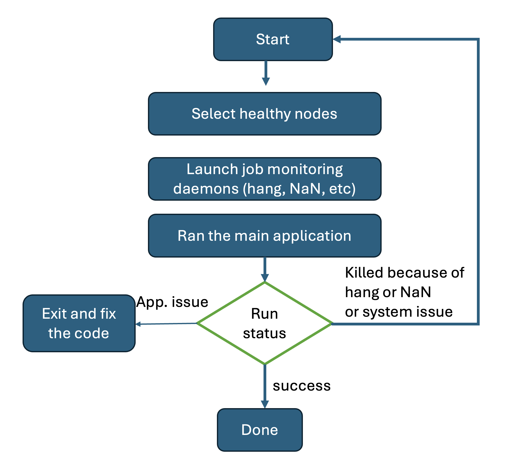

# Checkpoint / Restart tests on Exascale computing systems

For questions, please contact: Huihuo Zheng <huihuo.zheng@anl.gov>

Exascale computing systems often experience instabilities that can cause job terminations before completion.

To ensure large-scale simulations can continue efficiently, checkpoint/restart mechanisms are essential.

This repository provides:
	•	Simple programs to simulate common job execution issues:
(1) hanging, (2) mid-run failures, and (3) successful completion.
	•	Example submission scripts that automatically detect failures and restart jobs using healthy nodes.

The **key idea** is to over-allocate nodes, allowing jobs to be restarted on a healthy subset of nodes if a failure occurs.



## Install the package

```bash
git clone https://github.com/argonne-lcf/checkpoint_restart
cd checkpoint_restart
pip install -e .
```
This will install the `check_hang.py`, `check_nan.py`, and `get_healthy_nodes.sh` scripts into your environment.

## Useful Scripts

This repository includes several scripts to help manage and monitor jobs. After installation, `check_hang.py`, `check_nan.py`, and `get_healthy_nodes.sh` will be available in your PATH.

- `check_hang.py`: Monitors files for updates and kills a job if it stops changing for longer than a specified timeout. This is useful for detecting hung processes.
  ```bash
  check_hang.py --timeout 600 --check 10 --command "mpiexec python train.py"
  ```
  **Arguments:**
  - `--timeout`: Seconds of inactivity after which the job will be killed (default: 300).
  - `--check`: Seconds between file-activity checks (default: 5).
  - `--kill-command`: Shell command to terminate the job (default: `pkill -u $USER mpiexec`).
  - `--outputs`: Colon-separated list of output files to watch (default: `chkpt/latest`).
  - `--grace`: Seconds to wait after sending the kill command before exiting (default: 10).
  - `--dry-run`: If set, do not actually run the kill command—only log the action.

- `check_nan.py`: Monitors text output files for `NaN` or `Inf` values and terminates the job if they are found. This is useful for catching numerical stability issues.
  ```bash
  check_nan.py --outputs "logs/*.out" --check 15 --kill-command "scancel $SLURM_JOB_ID"
  ```
  **Arguments:**
  - `--outputs`: Glob pattern for files to watch.
  - `--recursive`: Enable recursive globbing.
  - `--check`: Polling interval in seconds (default: 15).
  - `--timeout`: Exit with code 0 if no NaN/Inf found after this many seconds (0 disables timeout).
  - `--include-inf`: Also treat 'inf' tokens as fatal.
  - `--pid`: If set, send a signal to this PID on detection.
  - `--signal`: Signal to send when using `--pid` (default: `TERM`).
  - `--grace`: Seconds to wait before escalating to `SIGKILL` if `--pid` is used (default: 15).
  - `--kill-command`: Arbitrary shell command to run on detection.
  - `--dry-run`: Detect and report but do not kill or run commands.
  - `--verbose`: Print verbose progress messages.

- `get_healthy_nodes.sh`: Selects a subset of healthy nodes from a larger allocation, writing them to a new nodefile. This is key to the restart mechanism.
  ```bash
  get_healthy_nodes.sh NODEFILE NUM_NODES_TO_SELECT NEW_NODEFILE
  ```

- `utils/flush.sh`: A utility to clean up processes on allocated nodes, excluding the head node. This script is not installed via pip.
  ```bash
  PBS_NODEFILE=NODEFILE ./utils/flush.sh
  ```

## Simulation of job execution: hang, fail, success
The test_pyjob.py script allows you to simulate various job behaviors:
```bash
--hang N              # Hang for N seconds
--fail N              # Fail after N seconds
--compute T           # Compute time per iteration
--niters NITERS       # Total number of iterations
--checkpoint PATH     # Checkpoint file path
--checkpoint_time T   # Time to write a single checkpoint
```

```
python test_pyjob.py --fail 120 --checkpoint ./chkpt --niters 1000
```


## Example submission scripts
- [qsub_multi_mpiexec.sc](./qsub_multi_mpiexec.sc)
  submission script doing continual trials of mpiexec until success or timeout

## Various simulation examples
- [fail/](./fail): job failed after 100 seconds, restart
- [hang/](./hang): job hang, kill and restart
- [success/](./success): job run seccessfully
- [nan/](./nan): NaN after a few iterations, restart

## Checkpoint interval optimization utility
- [optimal_checkpointing.py](./optimal_checkpointing.py)
  Determine the optimal time interval of computation between checkpoints
  for a job of determined node size and checkpointed memory per node
