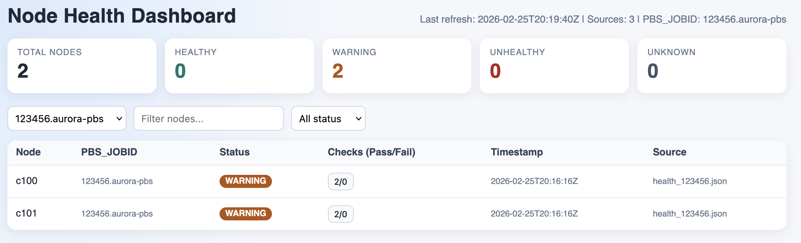

# System Monitoring

## Health Check Runner

- Script: `run_health_checks.py`
- Config: `health_checks.yaml`
- Purpose: build and run microkernel-based health checks.

Example:
```bash
python system_monitoring/run_health_checks.py --build
```

Export dashboard JSON from a run:
```bash
python system_monitoring/run_health_checks.py \
  --build \
  --dashboard-json system_monitoring/data/health_{job_id}.json \
  --pbs-jobid "$PBS_JOBID" \
  --nodefile "$PBS_NODEFILE"
```

`--nodefile` (defaults to `$PBS_NODEFILE`) makes the output include one node record per host in the nodefile, each with `status` / `health_condition`.

By default, writing is append/upsert by `(PBS_JOBID, node)`.
If `--dashboard-json` is omitted and `--pbs-jobid` is provided, output goes to `system_monitoring/data/health_<job_id>.json`.
Use `--overwrite-dashboard-json` if you want to replace the file content with only the current run.

## Dashboard (Initial Version)

- Script: `dashboard.py`
- Purpose: serve a simple HTTP dashboard that reads health JSON files and visualizes per-node status.
- UI includes a `PBS_JOBID` selector to filter displayed nodes per job.

### Start the dashboard

```bash
python system_monitoring/dashboard.py --data-dir system_monitoring/data --host 127.0.0.1 --port 8080
```

Then open `http://127.0.0.1:8080`.



The screenshot above shows the dashboard table with node name, `PBS_JOBID`, node status, and the clickable `Checks (Pass/Fail)` cell.  
Clicking the checks cell opens a detail popup with exact passed and failed check names for that node.

### JSON input format

The loader accepts either:

1. a list of node records, or
2. an object with a `nodes` list.

Each record can include:

- `node` (or `hostname`/`host`/`name`)
- `PBS_JOBID` (or `pbs_jobid`/`job_id`/`jobid`/`job`) for job-level filtering
- `status` (`healthy`, `warning`, `unhealthy`, `unknown`) or `healthy: true|false`
- `timestamp` (ISO8601 recommended)
- any additional fields under `details`

Sample file pattern: `system_monitoring/data/health_<job_id>.json`.

The dashboard table includes a per-node `Checks (Pass/Fail)` field derived from each node's check summary.
It also shows check names directly from:
- `summary.passed_check_names`
- `summary.failed_check_names`

### API endpoints

- `GET /api/health`: current summary and node table as JSON
- `GET /api/health?job_id=<PBS_JOBID>`: filtered view for one job id
- `GET /api/ping`: liveness probe
